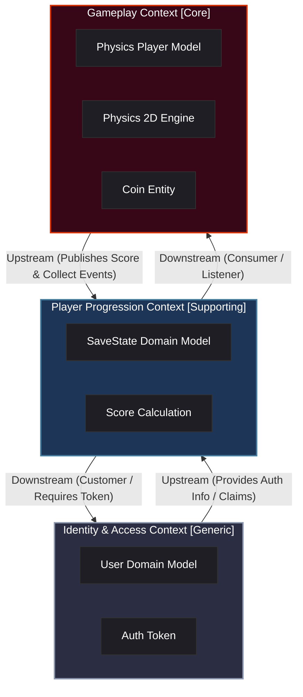
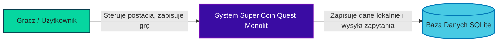
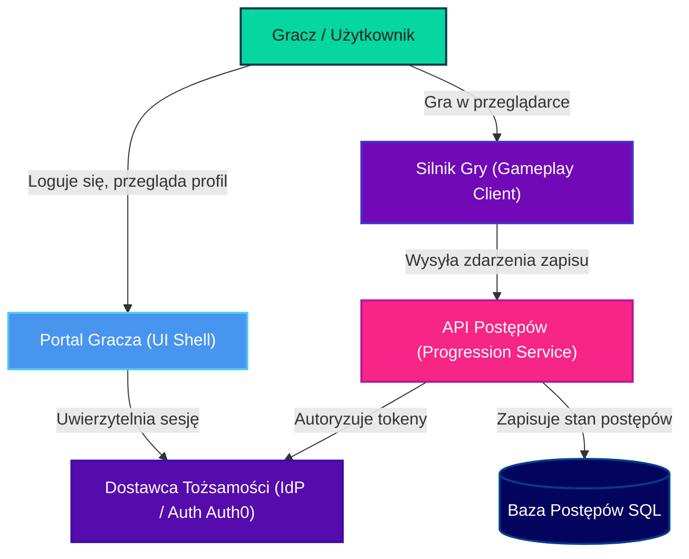
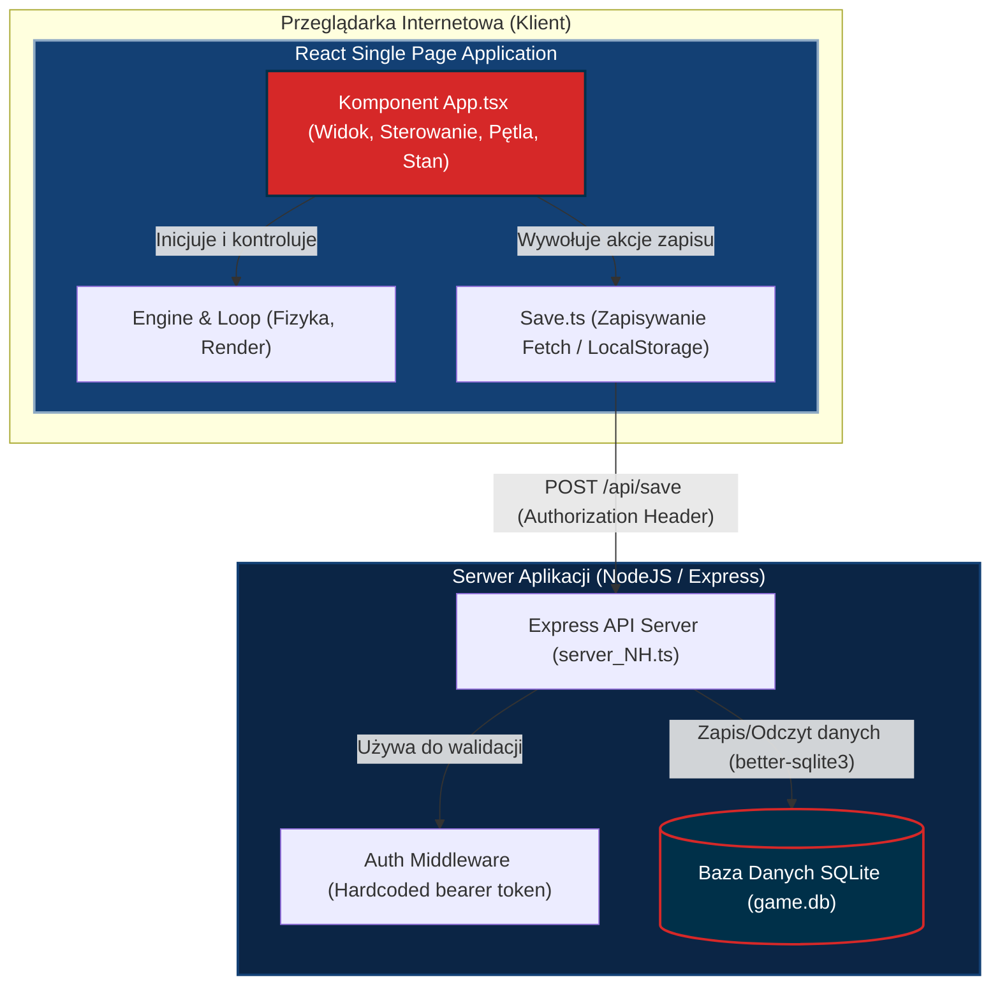
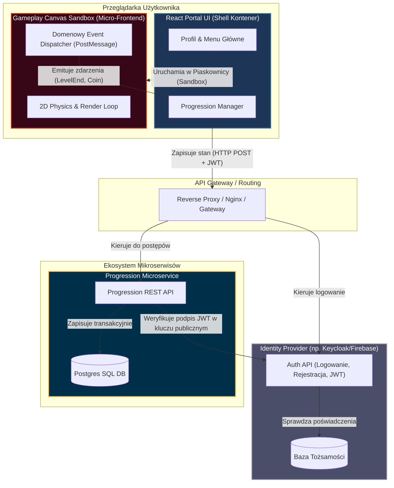

# Dekonstrukcja Systemu „Super Coin Quest”
## Analiza Strategiczna DDD oraz Wizualizacja Architektury w Modelu C4

---

## 1. Analiza własnego przypadku (Case Study) – Dług Technologiczny i „Big Ball of Mud”

Gra platformowa **Super Coin Quest** została zaprojektowana jako jednoplikowy frontend oparty na bibliotece React (Vite) komunikujący się bezpośrednio z uproszczonym serwerem backendowym w technologii Express i SQLite (`better-sqlite3`). Mimo wysokiego poziomu pokrycia testami automatycznymi (Vitest i Playwright E2E), system wykazuje fundamentalne objawy antywzorca **Wielkiej Kuli Błota (Big Ball of Mud)** oraz istotny dług technologiczny na poziomie architektury aplikacyjnej.

> [!WARNING]
> ### Główne symptomy „Wielkiej Kuli Błota” w projekcie:
> *   **Brak separacji odpowiedzialności (Separation of Concerns)**: Komponent [App.tsx](file:///c:/Users/kolyas/Desktop/aitsl/AiTSI/Project/src/App.tsx) jest monolitem pełniącym jednocześnie funkcje:
>     *   **Zarządcy stanu gry** (przechowuje indeks poziomu, punktację, zebrane monety za pomocą React State oraz `useRef` dla gracza i cząsteczek).
>     *   **Kontrolera wejścia** (nasłuchiwanie klawiatury w `useEffect` poprzez funkcję `attachKeyboardControls`).
>     *   **Pętli fizyki i renderowania** (inicjalizacja `runGameLoop` bezpośrednio z poziomu hooka `useEffect`).
>     *   **Warstwy sieciowej** (wywołania `fetch` bezpośrednio z funkcji `saveGame`, `loadGame` i `checkSave` wewnątrz komponentu).
>     *   **Prezentacji (Widoku)** (renderowanie tagu `<canvas>`, nakładek stanów HUD oraz alternatywnych kontrolek dotykowych dla urządzeń mobilnych).
> *   **Hybrydowe i niestabilne zarządzanie stanem**:
>     Stan fizyczny postaci (`playerRef.current`) oraz klawiatury (`keysRef.current`) opiera się na referencjach mutowalnych (`useRef`), które modyfikowane są synchronicznie w klatkach renderowania (`loop.ts`). Z kolei stan punktowy (`score`) i zebrane monety (`coinsCollected`) są replikowane do stanu Reacta (`setGameState`, `syncState`) w celu odświeżenia drzewa DOM HUD-a. Prowadzi to do dwukierunkowych i niekontrolowanych sprzężeń zwrotnych, utrudniając analizę przepływu danych.
> *   **Wyciek szczegółów implementacji na potrzeby testów**:
>     W pliku [App.tsx#L125-136](file:///c:/Users/kolyas/Desktop/aitsl/AiTSI/Project/src/App.tsx#L125-136) zaimplementowano jawne wstrzykiwanie referencji wewnętrznych gry do globalnego obiektu przeglądarki (`window as any).__GAME_STATE__` oraz `(window as any).__SET_LEVEL`). Jest to obejście (bypass) enkapsulacji niezbędne dla testów E2E w Playwright. Świadczy to o braku wyodrębnionego API domeny gry.
> *   **Hardcoded Secrets i podatności**:
>     Zarówno klient w pliku [save.ts](file:///c:/Users/kolyas/Desktop/aitsl/AiTSI/Project/src/game/save.ts) jak i serwer w [server_NH.ts](file:///c:/Users/kolyas/Desktop/aitsl/AiTSI/Project/server_NH.ts) posiadają zaszyte na stałe wartości uwierzytelniania (`Bearer mock-token-123`). Baza danych SQLite współdzieli środowisko wykonawcze z serwerem Express bez warstwy translacji danych lub wzorca Repository.

---

## 2. Identyfikacja Subdomen (Dekompozycja Domeny)

Dokonując dekompozycji systemu zgodnie z metodyką strategicznego Domain-Driven Design (DDD), możemy wyodrębnić trzy kluczowe subdomeny biznesowe. Taki podział pozwala przypisać odpowiedni priorytet prac programistycznych i dobrać technologie.

```mermaid
gantt
    title Klasyfikacja Subdomen Biznesowych w Super Coin Quest
    dateFormat  X
    axisFormat %s
    
    section Core (Silnik i Fizyka)
    Unikalna logika rozgrywki, kolizje, ruch postaci : active, 0, 100
    
    section Supporting (Postępy i Statystyki)
    Zapis stanu, tabele wyników, odblokowane etapy : 0, 60
    
    section Generic (Uwierzytelnianie)
    Zarządzanie sesją, rejestracja, tokeny bezpieczeństwa : 0, 30
```

### Klasyfikacja i charakterystyka subdomen:

| Typ Subdomeny | Nazwa | Opis Biznesowy | Poziom Złożoności | Rekomendacja Strategiczna |
| :--- | :--- | :--- | :--- | :--- |
| **Core Domain** *(Główna)* | **Silnik Rozgrywki i Fizyka 2D (Gameplay & Physics)** | Autorska pętla gry, algorytmy kolizji platform (AABB), dynamika skoków, grawitacja, system detekcji zbierania obiektów. Stanowi o grywalności i unikalności produktu. | Wysoki (wymaga precyzji obliczeń matematycznych i optymalizacji klatkowej) | Budowa własna (Custom Build). Kod musi być maksymalnie wydajny i niezależny od zewnętrznych frameworków UI. |
| **Supporting Subdomain** *(Wspierająca)* | **System Postępów i Zapisu Gry (Progression & Stats)** | Utrzymywanie informacji o odblokowanych poziomach, zebranych monetach na danym etapie oraz historii punktowej. | Średni (operacje CRUD, spójność zapisu w bazie danych) | Budowa własna, ale w oparciu o czystą architekturę i wzorzec CQRS/Repository w celu łatwego rozszerzania statystyk. |
| **Generic Subdomain** *(Ogólna)* | **Uwierzytelnianie i Zarządzanie Tożsamością (IAM)** | Logowanie użytkowników, zabezpieczanie endpointów API, zarządzanie tokenami i sesjami. | Niski/Standardowy (powszechnie rozwiązany problem) | Zastąpienie zewnętrznym dostawcą SaaS/gotowym rozwiązaniem open-source (np. Supabase Auth, Firebase Auth, Keycloak lub AWS Cognito). |

---

## 3. Projektowanie Granic Semantycznych (Bounded Contexts)

W celu wyeliminowania wieloznaczności pojęciowych oraz izolacji logiki, wyznaczamy trzy Ograniczone Konteksty (Bounded Contexts). Każdy z nich definiuje swój własny, spójny model danych i operuje na precyzyjnie określonym Języku Wszechobecnym (Ubiquitous Language).

### 3.1. Słowniki Pojęć (Ubiquitous Language)

#### A. Kontekst Rozgrywki (Gameplay Context)
Kontekst czasu rzeczywistego (skupiony na pętli gry i silniku Canvas).

*   **Aktor fizyczny (Player / Character)**: Obiekt posiadający współrzędne 2D (x, y), wektor prędkości (vx, vy), stan podłoża (grounded) i kierunek zwrotu (facing).
*   **Moneta fizyczna (Coin Entity)**: Obiekt fizyczny posiadający pozycję i identyfikator ID, zdolny do wejścia w interakcję z aktorem.
*   **Przeszkoda / Platforma (Platform)**: Statyczny obiekt prostokątny reprezentujący kolizyjną geometrię poziomu.
*   **Wyjście (Exit)**: Prostokąt kończący pomyślnie fizyczny poziom.
*   **Klatka (Frame)**: Pojedyncze wyrenderowanie stanu gry na elemencie Canvas.

#### B. Kontekst Postępu Gracza (Progression Context)
Kontekst transakcyjny (skupiony na zapisie stanu i statystykach).

*   **Zapis gry (Save State)**: Trwały dokument zawierający postęp (najwyższy odblokowany poziom, suma punktów).
*   **Wynik punktowy (Score)**: Liczba reprezentująca sumę punktów zdobytych przez gracza na podstawie zebranych monet.
*   **Zebrana moneta (Collected Coin ID)**: Unikalny klucz numeryczny monety, która została permanentnie zapisana jako zebrana na danym poziomie.
*   **Aktywny Poziom (Active Level Index)**: Indeks numeryczny określający poziom, na którym gracz zakończył ostatni poprawny zapis.

#### C. Kontekst Tożsamości i Dostępu (Identity Context)
Kontekst bezpieczeństwa (skupiony na kontach użytkowników).

*   **Użytkownik (User)**: Rekord w bazie danych reprezentujący tożsamość gracza (username, zahaszowane hasło).
*   **Token (Auth Token)**: Bezpieczny ciąg znaków (np. JWT) potwierdzający tożsamość i uprawnienia przy komunikacji z API.
*   **Sesja (Session)**: Czasowy stan zalogowania użytkownika w kliencie gry.

> [!NOTE]
> ### Eliminacja wieloznaczności semantycznych:
> *   **Moneta (Coin)**: W *Gameplay Context* to dwuwymiarowy punkt kolizyjny z flagą aktywności renderowany w 60 FPS. W *Progression Context* to jedynie identyfikator numeryczny (`number`) w tablicy reprezentującej stan zaliczenia.
> *   **Poziom (Level)**: W *Gameplay Context* to obiekt konfiguracyjny zwierający tablice fizycznych struktur. W *Progression Context* to indeks (`level_index: 0, 1, 2`) służący do odtworzenia gry.
> *   **Gracz (Player)** vs **Użytkownik (User)**: W *Gameplay Context* to „Player” posiadający wektory prędkości. W *Identity Context* to „User” posiadający token i hasło.

---

### 3.2. Mapa Kontekstów (Context Map)

Poniższy diagram przedstawia relacje i przepływy danych pomiędzy zdefiniowanymi kontekstami.

#### Relacje w modelu:
1.  **Gameplay Context -> Player Progression Context (Upstream/Downstream z ACL / Customer-Supplier)**:
    Rozgrywka w czasie rzeczywistym nie powinna wiedzieć o bazie danych ani protokole HTTP. Emituje ona czyste zdarzenia domenowe (np. `LevelCompleted`, `CoinCollected`). Kontekst postępów subskrybuje te zdarzenia i przetwarza je na stan zapisu.
2.  **Identity Context -> Player Progression Context (Upstream/Downstream)**:
    Kontekst postępów wymaga tożsamości użytkownika w celu powiązania zapisu stanu z konkretnym kontem (`user_id`). Bez poprawnej autoryzacji żądania zapisu są odrzucane.

---

## 4. Wizualizacja Architektury (Model C4)

Aby udokumentować przejście systemu z monolitycznej kuli błota do zintegrowanej architektury domenowej, przedstawiono diagramy poziomu 1 (System Context) oraz poziomu 2 (Container) w wersjach **Obecnej (As-Is)** oraz **Docelowej (To-Be)**.

### 4.1. Poziom 1: Diagram Kontekstu Systemu (System Context)

#### Stan Obecny (As-Is)
W obecnym stanie cały system jest postrzegany jako jeden monoblok. Użytkownik wchodzi w bezpośrednią interakcję z połączoną aplikacją kliencko-serwerową.

#### Stan Docelowy (To-Be)
W stanie docelowym następuje separacja systemów. Silnik gry (aplikacja kliencka) staje się niezależnym systemem, który komunikuje się z dedykowanymi usługami API.

---

### 4.2. Poziom 2: Diagram Kontenerów (Container Diagram)

#### Stan Obecny (As-Is)
Wskazuje na silne powiązanie wewnątrz kontenera aplikacji frontendowej. Brak izolacji komponentów silnika 2D od API.

#### Stan Docelowy (To-Be)
Docelowa architektura kontenerowa wprowadza czysty podział na moduł gry, portal otaczający oraz niezależne mikroserwisy backendowe.

### Korzyści z architektury docelowej (To-Be):
1.  **Piaskownica gry (Sandboxed Game Engine)**:
    Silnik gry `Gameplay Canvas` jest umieszczony w odizolowanym środowisku (np. iframe lub mikro-frontend). Nie ma on pojęcia o sieci, tokenach czy bazach danych. Komunikuje się z otoczeniem za pomocą standardowej szyny zdarzeń (`postMessage` lub niestandardowych zdarzeń DOM). Dzięki temu silnik gry staje się w 100% testowalny jednostkowo bez mockowania sieci.
2.  **Modularny i skalowalny backend**:
    Baza postępów (`ProgDB`) jest odizolowana od bazy uwierzytelniania (`AuthDB`). Awaria modułu tożsamości nie blokuje możliwości dokończenia rozgrywanego aktualnie poziomu (stan zapisu może zostać zbuforowany w przeglądarce).
3.  **Zabezpieczona autoryzacja**:
    Zastąpienie tokenu mockowanego (`mock-token-123`) pełnym standardem OAuth2/OIDC z asymetrycznym podpisem kluczy (RS256) wyklucza podatność na fałszowanie zapytań HTTP w testach i na produkcji.

---

## 5. Podsumowanie Dekonstrukcji i Rekomendacje Techniczne

Wykazany w kroku 1 dług technologiczny nie blokował stabilnego działania małej gry demonstracyjnej, jednak uniemożliwiałby jej rozwój do skali komercyjnej produkcji MMO lub gry wieloosobowej. Wdrożenie zaproponowanych zmian w ramach modelowania strategicznego DDD pozwala na:
*   **Łatwiejsze testowanie**: Możliwość przetestowania samej fizyki i mechaniki kolizji bez konieczności uruchamiania serwera backendowego czy mockowania obiektów globalnych window.
*   **Podział prac w zespole**: Jeden zespół (np. Frontend/GameDev) może optymalizować renderowanie klatek na Canvas, podczas gdy drugi zespół (Backend/Cloud) rozwija funkcjonalności społecznościowe, tabele liderów (Leaderboards) i systemy płatności w mikropłatnościach.
*   **Prawdziwe bezpieczeństwo**: Usunięcie podatności wycieku tożsamości poprzez separację domenową autoryzacji.
